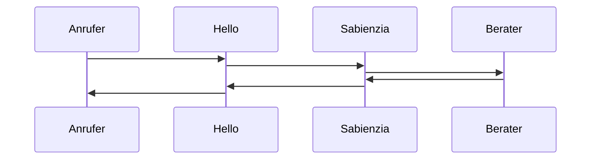
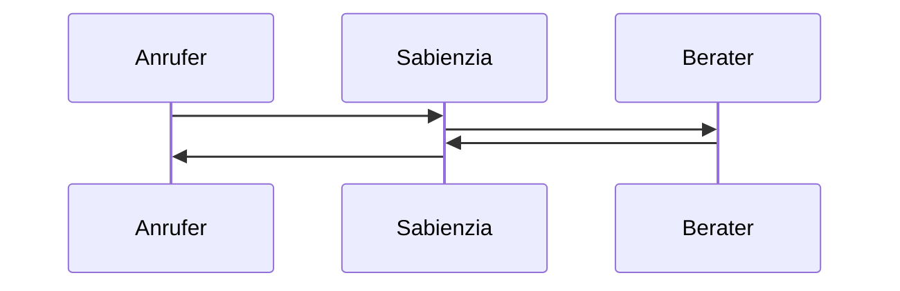

Der erste Call ist betroffen, der zweite nicht.
Der Anruf hat einen Delay von etwa 5 Sekunden.
Auffällig war auch eine kurzes Replay von etwa 0.5 Sekunden von Beraterseite, also eine Aufnahme von etwa 0.5 Sekunden wurde wiederholt.

Bei folgender Konstellation tritt es aber nicht auf:

